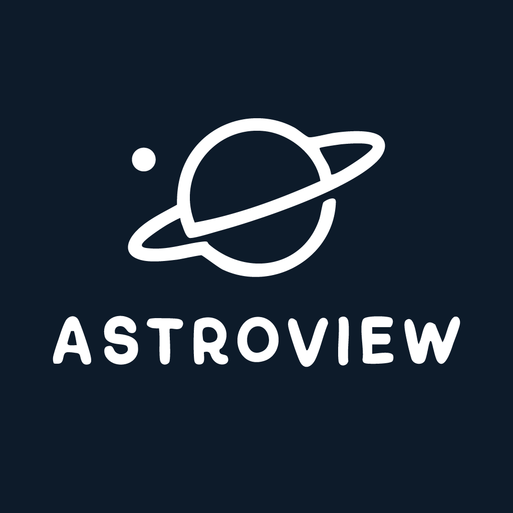

# 🌌 AstroView

<div align="center">
  
  <p><em>Explora el universo desde tu dispositivo móvil</em></p>
</div>

## 📱 Descripción

AstroView es una aplicación móvil moderna desarrollada con React Native y Expo que permite a los usuarios explorar y aprender sobre los planetas, estrellas y otros cuerpos celestes del universo. Con una interfaz de usuario intuitiva y hermosa, los usuarios pueden acceder a información detallada, imágenes y datos astronómicos en tiempo real.

## ⚡ Tecnologías Principales


{{ ... }}


## 📁 Estructura del Proyecto

```
src/
├── 📱 app/                # Rutas y navegación (Expo Router)
├── 🧩 components/        # Componentes reutilizables
├── ⚙️ constants/         # Constantes y configuración
├── 🔌 services/         # Servicios y llamadas API
├── 📝 types/            # Definiciones de tipos TypeScript
└── 🛠️ utils/           # Utilidades y funciones auxiliares
```

## ✨ Características Principales

- 📱 Interfaz adaptativa y responsive
- 💾 Almacenamiento local con AsyncStorage
- 🔄 Gestión de estado con React Query
- ✅ Validación de formularios con React Hook Form y Zod

## 📋 Requisitos Previos

- 📦 Node.js (v18 o superior)
- 🔧 npm o yarn
- 📱 Expo CLI
- 📱 iOS Simulator o Android Emulator

## 🚀 Instalación

1. Clonar el repositorio:
```bash
git clone https://github.com/xXAreizaXx/AstroView.git
cd AstroView
```

2. Instalar dependencias:
```bash
npm install
# o
yarn install
```

3. Iniciar el proyecto:
```bash
npx expo start
```

## 📦 Dependencias Principales

### 🛠️ Producción
- 🎨 `@expo/vector-icons`: Iconografía
- 🧭 `@react-navigation`: Sistema de navegación
- 🔄 `@tanstack/react-query`: Gestión de estado y caché
- 🌐 `axios`: Cliente HTTP
- 🌫️ `expo-blur`: Efectos de desenfoque
- 🔐 `expo-local-authentication`: Autenticación biométrica
- 📝 `react-hook-form`: Manejo de formularios
- ✅ `zod`: Validación de esquemas

### 🔧 Desarrollo
- 📝 `eslint`: Linting de código
- 💅 `prettier`: Formateo de código
- 📘 `typescript`: Soporte de tipos

## 🔑 Variables de Entorno

Crear un archivo `.env` en la raíz del proyecto:

```env
EXPO_PUBLIC_API_URL=https://api.le-systeme-solaire.net/rest
```

## 👨‍💻 Autor

Jorge Areiza - [@xXAreizaXx](https://github.com/xXAreizaXx)

---

<div align="center">
  <p>Hecho con ❤️ y 🚀</p>
</div>
